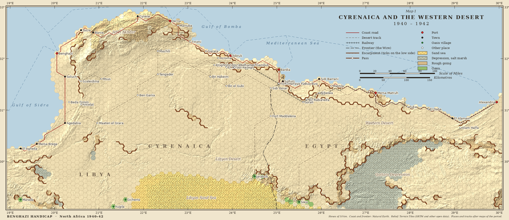

# Benghazi Handicap: North Africa 1940–42

An original operational wargame of the North African campaign, 1940–1942:
small and neat like the 8-bit desert wargames, but with the real ground, the
real tempo of a desert battle and, above all, the real supply problem.

- **`DESIGN.md`** — the game: scale, map, units, sequence of play, supply,
  combat, orders, scenarios, the computer opponent, presentation.
- **`docs/RULES.md`** — the rules specification the engine follows, numbered, with
  every constant named and its source given.
- **`docs/COUNTERS.md`** — hex and counter sizes, and notes on counter art.
- **`docs/SOURCES.md`** — where the map and the orders of battle come from.
- **`docs/CLEAN_ROOM.md`** — what this project may and may not use.

Status: the **map generator**, the **rules specification**, the **engine
core** on one scenario (Crusader) and a first **screen**. No computer opponent
yet beyond scripted test players.

## The engine

`engine/` is pure Python with no input or output: the same scenario and the
same orders always give the same game. A turn is the eight phases of
`docs/RULES.md` §5; each function names the rule it follows and each test the
rule it checks.

```
.venv/bin/python -m engine crusader attack nothing   # a whole game, no screen
```

plays Operation Crusader (`data/scenarios/crusader.json`: 91 units, each
division shown as its regiments and brigades under its HQ) between two scripted
players (`nothing`, `attack`, `retreat`, `explore`) and asserts the rules'
invariants after every turn.

## The screen

`screen/` is a pygame window on top of the engine: the map, the counters, the
six orders, the supply overlay and the zones overlay.

```
.venv/bin/python -m screen crusader                  # two players at one screen
.venv/bin/python -m screen crusader --axis nothing   # you are the Commonwealth
.venv/bin/python -m screen crusader --shot frame.png # one frame to a file, no window
```

Click one of your units, then click where it should go, or an enemy to attack
it. The order bar under the map has the six orders, the supply and zones
overlays and End turn; each has a key. With the keyboard alone:
press M, A or R, choose the hex with the arrow keys and press Enter. The mouse
wheel zooms at the pointer, dragging moves the map, and with a unit taken up
the map scrolls when the pointer reaches its edge. Layers, in the map's
corner, shows supply, zones and the key. Men on foot March where vehicles
Travel: by road or track only, a little faster than across country. A greyed button says why when pointed at, and
pressing a unit's own lit order takes it back. After an order the unit is let go; Next unit takes up the next one waiting and
brings it to the middle. A right click on your own units opens a menu to choose
one, group the whole stack or split a group up, at once; a stack of units from more
than one division is a Special Army Group, and the pencil by a group's name renames it. A division's units move and fight as one group until you split one off: click it in
the panel's list and order it, or press Split. Join sends a unit back to its
division, and Recall, on an HQ, calls them all in. An order stands from turn to turn until it is done,
and the screen steps through the units that are waiting for one. After End
turn the turn is played back: the movement, then each formation's strike in
turn, with the units it hits burning and a rattle as long as the damage, then
the outcome. F plays it faster, Right arrow goes on to the next scene, and any
other key skips it all. A finished game shows how its result was reached. The
map is `art/basemap.jpg`, the generated map with its relief
(`python -m mapgen base`). `docs/COUNTERS.md` has the hex and counter sizes and the
notes on counter art.

## The map



The map is not drawn by hand: `mapgen/` builds it from public geographic data.

```
python3 -m venv .venv && .venv/bin/pip install -r requirements.txt
.venv/bin/python -m mapgen all      # fetch the data, build data/map.json, draw map.png
.venv/bin/python -m pytest tests
```

- **123 × 44 hexes of 10 km**, from west of El Agheila to Alexandria and from the
  Cyrenaican coast south to Siwa.
- **Terrain per hex**: sea, desert, rough going, deep depression (the Qattara
  Depression), sand sea, oasis — from the coastline, from elevation and slope,
  and (the sand sea and the oases) from maps of the period.
- **Escarpments on hex edges**: the cliff lines are traced in the elevation data
  and laid on the hex edges they run between, so an unbroken cliff is an
  unbroken line on the map; hills ringed by escarpments become rough ground.
- **Places and routes** from `data/features.json` (53 places; the coast road,
  desert tracks and the railway): each route finds its own way over the
  generated ground between the places it names, and where it has to climb an
  escarpment, that crossing becomes a **pass**.
- **Drawn by hand where it matters most**: the Sollum escarpment, from the sea
  at Sollum south-east to Sofafi, with its two ways up — **Sollum Pass** (the
  coast road) and **Halfaya Pass** (a track) — and the two gentler escarpments
  that carry on east from Sofafi, behind Sidi Barrani and along the plateau
  edge to south of Matruh.
- **The picture**, `map.png`, is drawn in the manner of a map of the period:
  relief shading, a border with the degrees marked, a title block with legend
  and scale.
- The result, `data/map.json`, is readable: one row of terrain letters per map row.

Known limitations of this first version (see `docs/MAP.md`):

- the escarpments are checked against the elevation data, not against period
  maps, and only Sollum has named passes; elsewhere a pass is simply where a
  route climbs;
- about 20 period sites have approximate coordinates; places and tracks have
  been checked against two period maps (Gazala 1942 and Cyrenaica 1941, see
  `docs/MAP.md`), but the tracks are still joined from place to place, not traced;
- the sand sea's edge is read off a small-scale period map; the coastal salt
  marshes are not marked.

## The name

**The Benghazi Handicap** was the soldiers' name — the Australians', first — for
the retreat from Benghazi to Tobruk in the spring of 1941, with Rommel close
behind. The race was run again, in both directions: Benghazi changed hands five
times in under two years, as each advance along the coast road ran out of supply
and was thrown back. The retreat from the Gazala line in June 1942 earned its
own name, the *Gazala Gallop*.

> **Etymology.** Named for the great speed of the retreat; *handicap* is in the
> horse-racing sense. The field was large, the going was firm to dusty, and the
> favourite changed at every meeting.

Why this name:

- **It says what the game is about.** The campaign was decided by distance and
  supply — how far an army could go before its trucks could no longer feed it —
  and that is the centre of this design (`DESIGN.md` §6).
- **It is historical and nobody's product.** It is a period nickname (it is the
  title of a chapter in the Australian official history), not a trademark. A few tabletop wargame supplements have used it as a subtitle; no
  computer game uses it as its title.
- **It stands apart from other games.** Plainer names were considered and
  dropped because they sit too close to existing titles: "Desert War" (Matrix
  Games' *Desert War 1940–1942*, and a scenario title in older games) and
  "Desert Rats" (CCS, 1985, the 8-bit game that inspired this one).
- **The subtitle says the rest.** "North Africa 1940–42" tells a newcomer the
  subject at a glance.

This is an original game. It shares a subject — a public piece of history —
with many other wargames, and nothing else: its map is generated from public
geographic data, its orders of battle are compiled from historical sources, and
its rules, text and art are its own (`docs/CLEAN_ROOM.md`).
